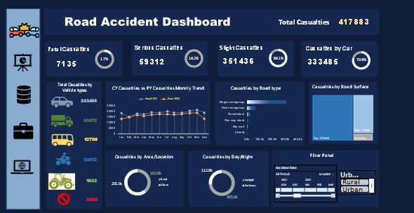

# Road Accident Analysis Dashboard (Excel)

This project is an interactive Excel dashboard analyzing road accident data in the UK. It contains 307,974 records and highlights key trends and insights by vehicle type, road type, lighting, area, and accident severity.

## Key Features

- Total records analyzed: **307,974**
- Built using **Excel**, **Power Query**, and **Pivot Charts**
- Fully **interactive** dashboard with:
  - Slicers for **Year**, **Area Type (Urban/Rural)**, and **Date**
  - KPI cards for Fatal, Serious, Slight Casualties
  - Vehicle-type-wise casualty analysis
  - Casualties by Road Type, Surface, Time of Day

## Key Insights

- **~80% of all casualties involve cars**
- **Higher accident rates in urban areas at night**
- Slight casualties form the majority (~84%) of all cases

## How It Works

- Data is cleaned and transformed using **Power Query**
- Dynamic visuals update based on selected filters/slicers
- All visuals are tied to pivot tables for performance

## Dashboard Preview

----

##  Tools Used

- Microsoft Excel
- Power Query
- Pivot Tables
- Slicers / Data Validation

## Files

| File Name | Description |
|-----------|-------------|
| `Road Accident Project.xlsx` | Main Excel file with the dashboard |
| `Road Accident Data.xlsx`  | Data used in the Excel file |
| `README.md` | Project description |
| `road accident dashboard.png` | Screenshot of dashboard (optional) |

## How to Use

1. Open `Road Accident Project.xlsx`
2. Use the slicers to filter by **year, area (urban/rural), or date**
3. Watch all KPIs and charts update dynamically

---

